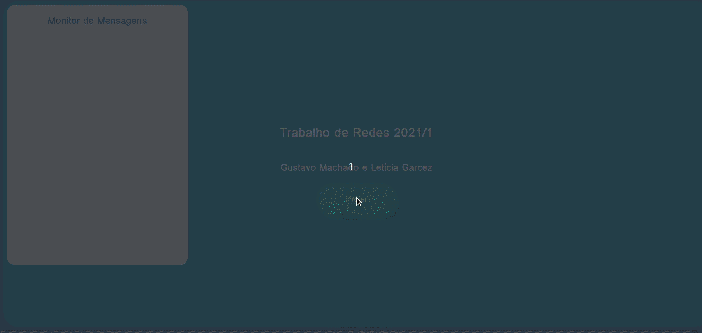
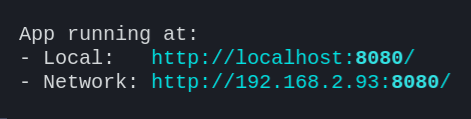

# Trabalho de Redes 2021/1
## Gustavo Machado e Letícia Garcez

## Enunciado do trabalho:

## Como rodar a aplicação
Para rodar a aplicação, é preciso ter o [node](https://nodejs.org/en/) instalado no seu computador. 
Uma vez que o node esteja instalado na sua máquina, você deve abrir a pasta **front** em um terminal e digitar o comando `npm i` para instalar as dependências do projeto.

Uma vez que as dependências tenham sido instaladas, você deve acessar a pasta **front/config** e alterar o arquivo **ip.js** substituindo o valor da variável pelo *ip* pelo valor do IP local do seu computador. Voltando à pasta front aberta no terminal, você deve rodar o comando `npm start` para iniciar a aplicação. Uma vez feito isso, o programa será compilado, e um endereço de acesso será mostrado no seu terminal:

O acesso na sua máquina pode ser feito pelo endereço **Local**, e o acessoem outras máquinas pode ser feito pelo endereço mostrado ne **Network**.

*Obs: Para terminar a aplicação é preciso apertar CTRL+C no terminal*

## Como utilizar a aplicação
Para utilizar a aplicação são necessários dois jogadores. Ambos devem abrir a página que corresponde à aplicação em seus dispositivos e clicar em iniciar. 

Uma vez que o jogador tenha clicado em iniciar, ele estará na lista de espera do jogo, e ficará esperando o segundo jogador entrar na aplicação, caso contrário o jogo não se iniciará.

Uma vez iniciado o jogo, o servidor da aplicação enviará para ambos os jogadores a mesma sequência de teclas que devem ser pressionadas, e cada jogador pode ver tanto a sua pontuação como a pontuação do adversário. 

O jogo acaba quando um dos jogadores apertar no botão de sair na tela. Isso gerará um alerta da mensagem que dirá se o jogador ganhou, perdeu, ou houve um empate.

**Importante: a aplicação não está funcional para mobile, mas você pode acessar o servidor da aplicação pelo celular e clicar no botão de iniciar para simular um segundo jogador e conseguir ver o jogo funcionando.**

## Links úteis
* [Paleta de cores utilizada no projeto](https://coolors.co/54478c-2c699a-048ba8-0db39e-16db93-83e377-b9e769-efea5a-f1c453-f29e4c)
